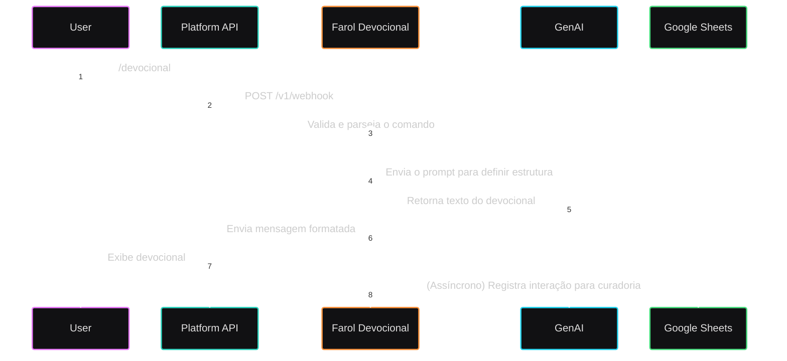
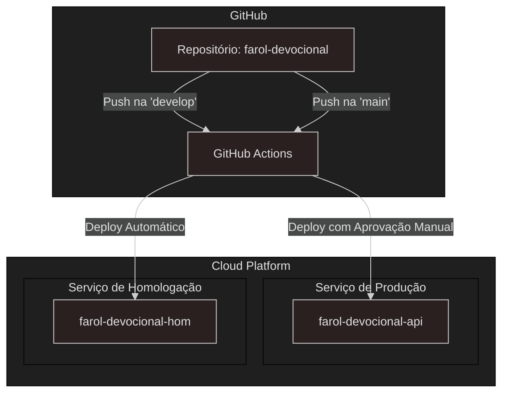

# API Farol Devocional — Arquitetura de Software v1.0

## 1. Objetivo
Este documento descreve a arquitetura do microserviço "Farol Devocional", um serviço stateless, de baixo custo e alta escalabilidade projetado para gerar devocionais cristãos via plataformas de chat.

## 2. Visão Geral
* **Entrada:** Um cliente (ex: bot do Telegram) envia uma requisição HTTP para a API.
* **Núcleo:** A API, rodando como um contêiner no Google Cloud Run, recebe a requisição, a valida e orquestra uma chamada para a API de IA generativa, como o Google Gemini, para gerar o processar e gerar as respostas.
* **Saída:** A API retorna o devocional formatado (em texto ou áudio) na resposta HTTP.
* **Curadoria:** De forma assíncrona ("fire-and-forget"), a API registra a interação em uma planilha do Google Sheets para curadoria, por se tratar de conteúdo que envolve espiritualidade e pode conter erros devido a geração com IA.

## 3. Componentes Lógicos
A aplicação segue uma Arquitetura em Camadas para garantir a separação de responsabilidades:
- **`Controller` (Camada de API):** Expõe os endpoints REST, valida os dados de entrada e delega para a camada de serviço.
- **`Service` (Camada de Negócio):** Contém a lógica de negócio principal. Orquestra a criação do prompt, a chamada ao `GeminiAdapter`, e a formatação da resposta.
- **`Adapter` (Camada de Integração):** Abstrai a comunicação com serviços externos. Teremos:
    - `[IA]Adapter`: Responsável por se comunicar com a API de IA.
    - `SheetsAdapter`: Responsável por se comunicar com a API do Google Sheets.
- **`Observability` (Transversal):** Módulos como Micrometer e Logback para coletar métricas e gerar logs estruturados.

## 4. Contratos da API (REST)

### `POST /v1/devocionais`
Gera um novo devocional.

**Request Body:**
```json
{
  "theme": "esperança",   // String, opcional. Se nulo ou vazio, gera com tema aleatório.
  "language": "pt-BR",    // String, opcional. Default: "pt-BR".
  "length": "curto",      // String, opcional (curto|padrao|completo). Default: "padrao".
  "includeAudio": false   // Boolean, opcional. Default: false.
}
````
**Response `200 OK` (com `includeAudio: false`):**

  * `Content-Type: application/json`

<!-- end list -->

```json
{
  "title": "A Rocha",
  "reference": "Hebreus 6:19",
  "text": "Em meio aos problemas da vida, devemos ter a esperança firme na rocha que é Cristo..."
}
```

**Response `200 OK` (com `includeAudio: true`):**

  * `Content-Type: audio/mpeg`
  * **Corpo da Resposta:** Os bytes brutos do arquivo de áudio gerado.

**Códigos de Erro:**

  * `400 Bad Request`: Erro de validação no request (ex: `theme` muito longo).
  * `429 Too Many Requests`: O cliente excedeu o limite de taxa (Rate Limit).
  * `504 Gateway Timeout`: A API do Gemini demorou muito para responder.

### Endpoints de Saúde (Spring Boot Actuator)

  * `GET /actuator/health/liveness`: Indica se a aplicação está "viva".
  * `GET /actuator/health/readiness`: Indica se a aplicação está "pronta" para receber tráfego.

## 5. Padrões de Resiliência

  * **Timeouts:** A infraestrutura terá um timeout de **50 segundos**. A chamada para a API do Gemini, via Resilience4j, terá um timeout de **40 segundos**.
  * **Rate Limiting:** A API implementará um limitador de taxa (via Bucket4j) com uma meta inicial de 2 requisições/minuto por IP.

## 6. Diagramas

### Diagrama de Sequência (Fluxo Principal)



### Diagrama de Implantação


